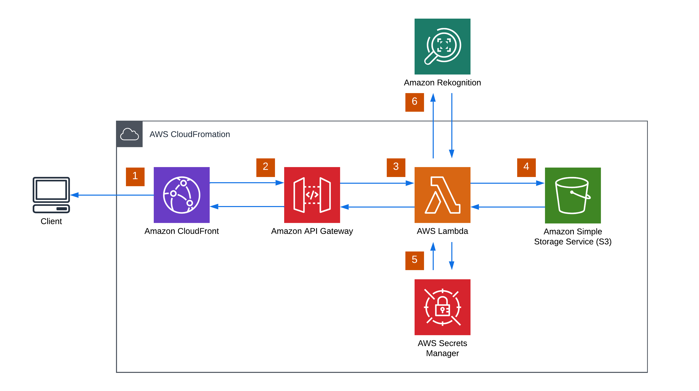

# Serverless Image Processing

A scalable, on-demand image processing system utilizing AWS Lambda, S3, and Cloudfront. This solution effectively manages numerous image-related operations such as resizing, cropping, and object recognition.

## Purpose

In the realm of modern web applications, the efficient handling and delivery of images are key to ensuring a superior user experience. The Serverless Image Handler caters to this requirement by employing a serverless framework that effortlessly connects with cloud services. This setup enables developers to concentrate on creating applications rich in features, while avoiding the complexities of managing image processing systems.

Ideal for projects ranging from content-rich websites to mobile apps, or any initiative that necessitates real-time image modification, the Serverless Image Handler provides an easy way to integrate image processing features. Its core objective is to demystify the challenges of image management, presenting a scalable and cost-effective option for projects of various scopes

## Table of Contents

- [Getting Started](#getting-started)
  - [Prerequisites](#prerequisites)
  - [Installation](#installation)
- [Architecture](#architecture)
- [Usage](#usage)
- [Configuration](#configuration)

## Getting Started

### Prerequisites
Before you start using the Serverless Image Handler, make sure you meet the following prerequisites:

1. **AWS Account:**
   - You need an active AWS account to deploy and utilize the Serverless Image Handler.

2. **AWS CLI:**
   - Install and set up the [AWS Command Line Interface (AWS CLI)](https://aws.amazon.com/cli/) to interact with AWS services locally.

3. **AWS Credentials:**
   - Ensure that you have your AWS credentials properly configured on your local machine. You can configure these credentials using the AWS CLI or other suitable methods.

4. **AWS Services:**
   - The Serverless Image Handler relies on the following AWS services:
     - **AWS CloudFormation:**
       - This service is used for infrastructure as code, allowing you to define and provision AWS infrastructure securely and predictably.

     - **Amazon CloudFront:**
       - It is a content delivery network (CDN) service that securely and efficiently delivers images to users.

     - **Amazon API Gateway:**
       - Used to create, publish, and manage APIs, providing a secure and scalable API endpoint for your Serverless Image Handler.

     - **AWS Lambda:**
       - Enables you to run code without the need to provision or manage servers, making it an excellent choice for serverless image processing functions.

     - **Amazon S3:**
       - A highly scalable object storage service used to store and retrieve images efficiently.

     - **Amazon Rekognition (optional):**
       - If you plan to use image recognition features, make sure that the [Amazon Rekognition](https://aws.amazon.com/rekognition/) service is properly configured and accessible.

     - **AWS Secrets Manager (optional):**
       - This service is used for securely storing and managing sensitive information, such as API keys or credentials.

Ensure that these services are configured and that you have the necessary permissions to deploy and manage resources within your AWS account.

### Installation

To set up the Serverless Image Handler, follow these steps:

1. **Upload the CloudFormation Template to Amazon S3:**
   - If your CloudFormation template is stored locally, manually upload it to an Amazon S3 bucket. Make sure the template is accessible for deployment.

2. **Initiate the Deployment of the Serverless Image Handler AWS CloudFormation template:**
   - Navigate to the [AWS CloudFormation Console](https://console.aws.amazon.com/cloudformation/).
   - Click the "Create stack" button.
   - Choose "Upload a template file" and use the "Choose file" option to select your CloudFormation template from your local machine.
   - Click "Next" to proceed with the deployment.

   *Note: By default, the template deploys in the US East (N. Virginia) Region. If you want to deploy it in a different AWS Region, utilize the Region selector in the console navigation bar.*

3. On the "Specify stack details" page, assign a name to your solution stack.

4. Under "Parameters," review and adjust the solution parameters as needed.

5. Click "Next."

6. On the "Configure stack options" page, click "Next."

7. On the "Review" page, carefully review and confirm the settings. Don't forget to select the box acknowledging that the template creates IAM resources.

8. Click "Create stack" to initiate the stack deployment.

9. Keep an eye on the stack status in the AWS CloudFormation console. You should expect a "CREATE_COMPLETE" status in approximately 15 minutes.

## Architecture

The Serverless Image Handler employs a scalable and serverless architecture, seamlessly integrating multiple essential AWS services to effectively process and deliver images.

    

### Explanation of the Workflow

1. **Client Request:**
   - When a client requests image processing, they send a request to the Amazon CloudFront distribution associated with the Serverless Image Handler.

2. **CloudFront Distribution:**
   - CloudFront serves as the content delivery network (CDN) and forwards the client's request to the Amazon API Gateway.

3. **Amazon API Gateway:**
   - API Gateway manages the API and triggers an AWS Lambda function to handle the requested image processing tasks.

4. **AWS Lambda:**
   - The Lambda function retrieves the original image from Amazon S3, applies the specified image processing features, and returns the processed image. Optionally, it may make calls to Amazon Rekognition for tasks like facial recognition or content moderation.

5. **Amazon S3 (Storage):**
   - Both the original and processed images are stored in Amazon S3, ensuring durability and scalability.

6. **Amazon Rekognition (Optional):**
   - If necessary, the Lambda function can interact with Amazon Rekognition for advanced image analysis.

7. **Secrets Manager (Optional):**
   - When signature validation is enabled, the Lambda function retrieves secret values from AWS Secrets Manager for added security.

8. **Response to Client:**
   - The Lambda function generates a response that includes the processed image or relevant information, which is sent back through API Gateway and CloudFront to the client.

This coordinated workflow guarantees efficient serverless image processing with a focus on scalability, security, and optimal performance.
## Usage

### Deploying the Serverless Image Handler

1. **Upload CloudFormation Template:**
   - Upload the CloudFormation template (`serverless-image-handler-template.yaml`) to an Amazon S3 bucket of your choice.

2. **Launch the CloudFormation Stack:**
   - Open the [AWS CloudFormation Console](https://console.aws.amazon.com/cloudformation/).
   - Click "Create stack" and choose "With new resources."
   - In the "Specify template" section, choose "Amazon S3 URL" and enter the URL of your uploaded CloudFormation template.
   - Follow the on-screen instructions to configure the stack parameters and complete the deployment.

### Configuring Lambda Function Features

1. **Feature Configuration:**
   - In the deployed Lambda function (`ImageHandlerFunction`), features such as smart cropping and content moderation are available.
   - Update the Lambda function code to customize the behavior based on your specific needs.

### Testing the Image Handler

1. **Invoke Lambda Function:**
   - Use the AWS Lambda Console or AWS CLI to test the Lambda function manually.
   - Provide input parameters such as the `imageKey` (S3 object key) and the desired `feature` ('smartCropping' or 'contentModeration').

2. **Inspect Results:**
   - Review the Lambda function logs in the AWS CloudWatch Console for debugging and troubleshooting.

### Additional Considerations

1. **Security:**
   - Review and enhance IAM roles and permissions for the Lambda function to adhere to security best practices.
   - Consider enabling AWS Key Management Service (KMS) encryption for S3 buckets if needed.

2. **Error Handling:**
   - Implement robust error handling in the Lambda function to handle various scenarios gracefully.

3. **Testing and Optimization:**
   - Test the solution thoroughly in a staging environment before deploying in production.
   - Optimize the Lambda function, CloudFront settings, and other configurations based on performance requirements.

Refer to the CloudFormation template, Lambda function code, and AWS documentation for detailed information on customization and advanced features.

## Configuration

The Serverless Image Handler provides various configuration options to tailor the behavior of the image processing solution. These options are specified during the deployment of the CloudFormation stack or can be adjusted later in the AWS Management Console.

### CloudFormation Stack Parameters

1. **Deploy Demo UI (`DeployDemoUI`):**
   - *Description:* Specify whether to deploy an additional S3 bucket for the demo user interface (UI).
   - *Values:* 'Yes' or 'No'
   - *Default:* 'Yes'
  
2. **Enable Signature (`EnableSignature`):**
   - *Description:* Specify whether to enable signature validation using AWS Secrets Manager.
   - *Values:* 'Yes' or 'No'
   - *Default:* 'No'

### Lambda Function Configuration

1. **Image Processing Features (`feature`):**
   - *Description:* The Lambda function supports various image processing features, including smart cropping and content moderation.
   - *Values:* 'smartCropping' or 'contentModeration'
   - *Usage:* Specify the desired feature when invoking the Lambda function manually or integrating it with other services.

2. **IAM Role Permissions (`LambdaExecutionRole`):**
   - *Description:* Adjust the IAM role permissions for the Lambda function to grant necessary access to S3, Rekognition, and other AWS services.
   - *Usage:* Modify the policies in the `LambdaExecutionRole` section of the CloudFormation template.

### S3 Bucket Configuration

1. **Image Source Bucket (`your-source-bucket`):**
   - *Description:* The S3 bucket where the original images are stored.
   - *Usage:* Replace 'your-source-bucket' with the actual name of your source S3 bucket in the Lambda function code.

2. **Demo UI Bucket (`DemoUIBucket`):**
   - *Description:* If 'Deploy Demo UI' is enabled, a separate S3 bucket is created for the optional demo user interface.
   - *Usage:* Upload your demo UI files (HTML, CSS, JavaScript) to this bucket.

### Additional Considerations

1. **Security Configuration:**
   - *Description:* Review and enhance IAM roles and permissions for security best practices.
   - *Usage:* Adjust policies in the `LambdaExecutionRole` section of the CloudFormation template.

2. **Error Handling and Logging:**
   - *Description:* Implement robust error handling in the Lambda function.
   - *Usage:* Update the Lambda function code to provide meaningful error responses and log to CloudWatch Logs.

3. **Content Type Handling:**
   - *Description:* Adjust the content type handling in the Lambda function based on the format of your images.
   - *Usage:* Update the Lambda function code to handle different image formats.

Refer to the CloudFormation template and Lambda function code for detailed information on each configuration option. Customize these options based on your specific project requirements.

## Support and Feedback
Feel free to delve into the code and make adjustments to suit your specific requirements. If you encounter any questions or issues, don't hesitate to reach out. Happy coding!
